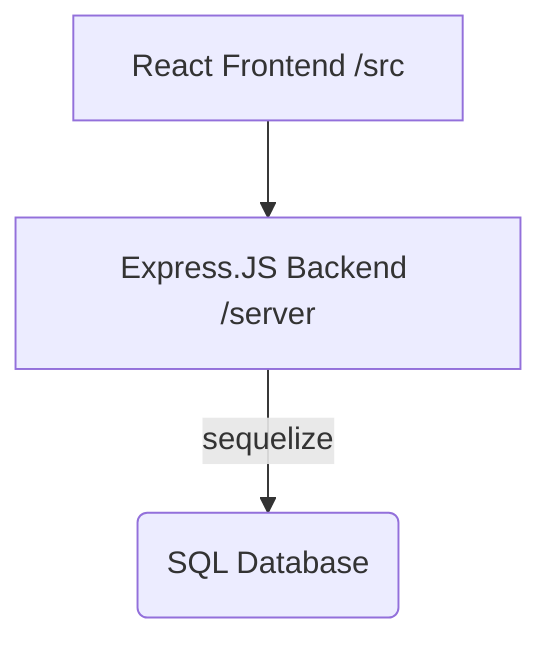

# OhFlow

OhFlow is a lowcode GUI to create workflows that can process objects. OhFlow heavily uses the [React Flow](https://reactflow.dev/) Library to render the GUI.

For information on the concepts behind the application, read the [Overview](OVERVIEW.md)

If you are looking to build a GUI workflow editor (or embed one in your application), this application can be a good starting point.

OhFlow is a work in progress. If you'd like to contribute, the best way to start is to run it locally, play with it, and then work on completing sections of the application that need work.

# Quick Start:

To get started run the following:

`node ./server/app.js`

To start the (backend) webserver.

Then, in a separate window run:

`npm start`

To start the (frontend) GUI and then you can visit `http://localhost:3000` to use the app.

# Available Scripts

### `npm run build`

Builds the app for production to the `build` folder.\
It correctly bundles React in production mode and optimizes the build for the best performance.

The build is minified and the filenames include the hashes.\
Your app is ready to be deployed!

# Architecture

OhFlow is designed as a React frontend that talks to a very simple Express.JS backend

The database uses the sequelize database abstraction in Node.JS so you can point it
at most common databases including MySQL or Postgres. Out of the box it points to
a SQLite Database stored in the `/db` directory
